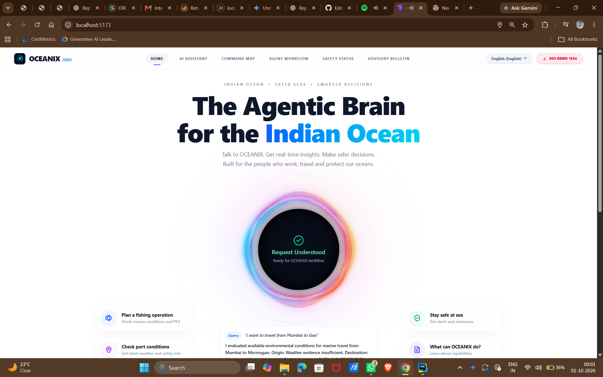
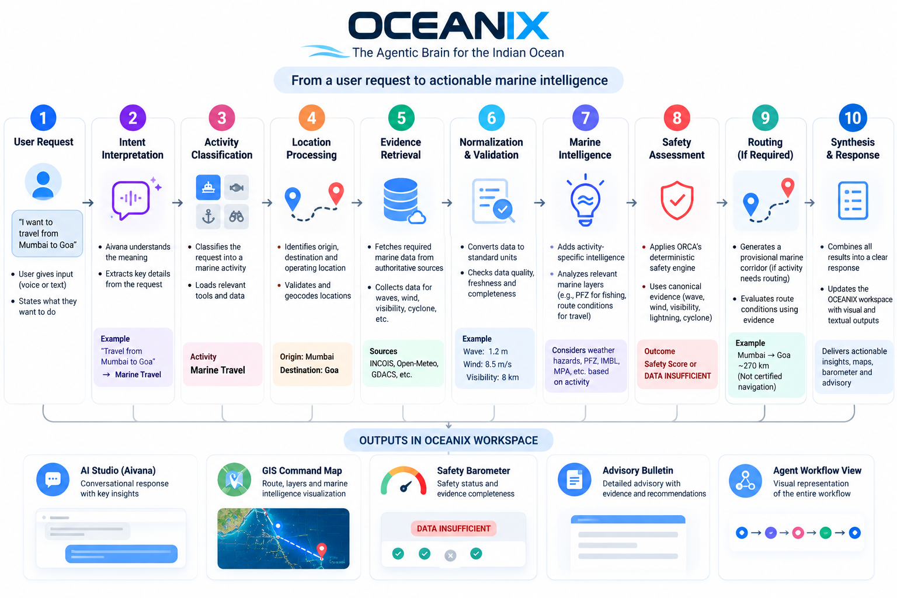
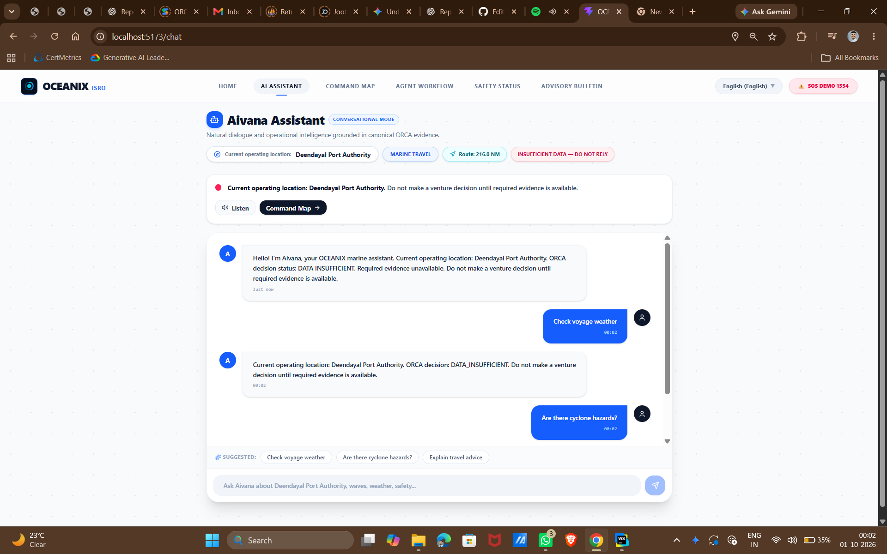
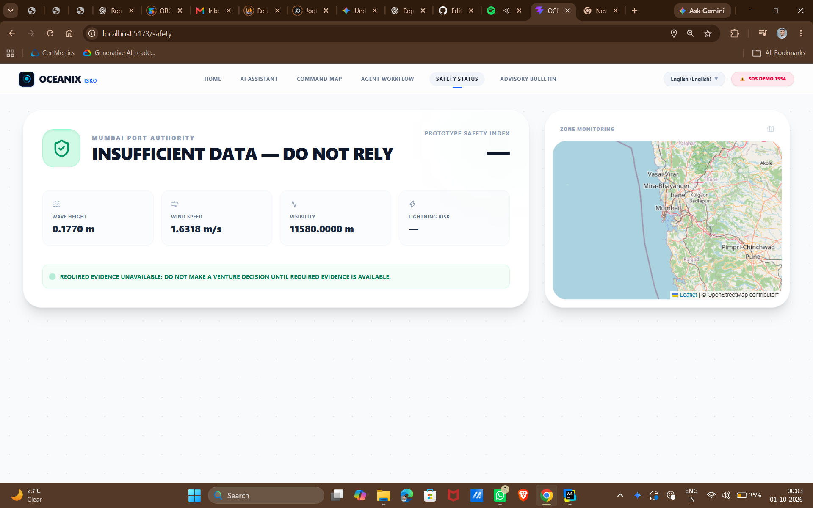
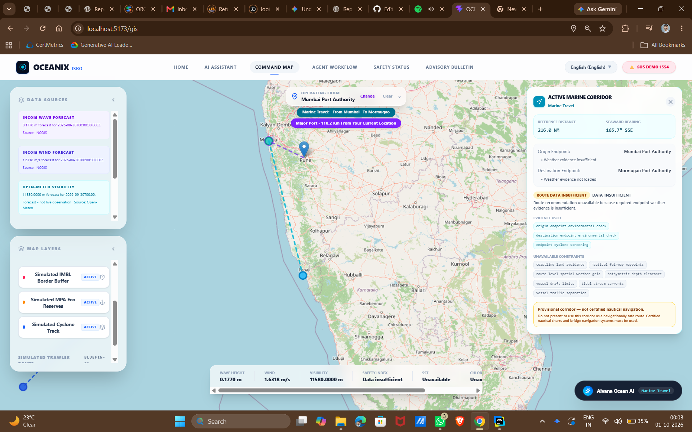
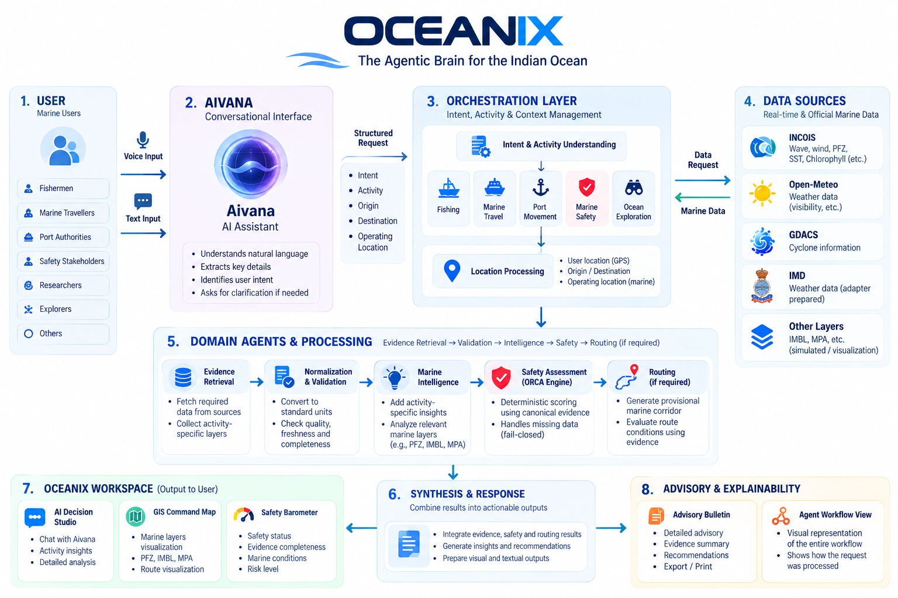

# 🌊 OCEANIX

### The Agentic Brain for the Indian Ocean

OCEANIX is an **activity-aware marine intelligence workspace** designed to help users understand marine conditions, safety, oceanographic information, and spatial intelligence through natural-language interaction.

Instead of manually working with multiple marine datasets and tools, users can describe what they want to do and OCEANIX converts the request into a structured marine intelligence workflow.

---

## 📸 OCEANIX



OCEANIX brings together:

- 🎙️ **Aivana** — conversational marine interface
- 🧠 **Activity-aware intelligence**
- 🛡️ **ORCA** — deterministic safety engine
- 🗺️ **GIS Command Map**
- 🧭 **Marine routing framework**
- 📊 **Safety and evidence monitoring**
- 📰 **Marine advisory and explainability**

---

# 💡 The Problem

Marine activities often require information from multiple sources, including:

- Wave conditions
- Wind
- Visibility
- Cyclone conditions
- Lightning risk
- Potential Fishing Zones (PFZ)
- Sea Surface Temperature
- Chlorophyll
- Marine spatial information

The challenge is not only finding this information, but understanding **which information is relevant to the user's actual activity and decision**.

A fisherman, vessel operator, researcher, or safety stakeholder may need different information from the same region.

OCEANIX addresses this through an **activity-aware marine intelligence workflow**.

---

# 🧠 How OCEANIX Works

A user can interact with OCEANIX using natural language.

For example:

> "I want to travel from Mumbai to Goa."

The request is processed through a structured workflow:

```text
User Request
     ↓
Intent Interpretation
     ↓
Activity Classification
     ↓
Location Processing
     ↓
Evidence Retrieval
     ↓
Normalization & Validation
     ↓
Marine Intelligence
     ↓
Safety Assessment
     ↓
Routing (if required)
     ↓
Synthesis & Response
```



The workflow connects the user's request with the appropriate activity, location, marine evidence, safety assessment, routing requirements, and final workspace outputs.

---

# 🎙️ Aivana

Aivana is the conversational interface of OCEANIX.

Users can interact with OCEANIX using:

- Voice
- Text
- Natural-language marine requests

Aivana interprets the user's request and extracts relevant context such as:

- Intent
- Activity
- Origin
- Destination
- Operating location

If required information is missing, the system can ask for clarification instead of silently assuming it.



### Example

```text
User:
"I want to travel from Mumbai to Goa."

        ↓

Activity:
Marine Travel

Origin:
Mumbai

Destination:
Goa
```

The structured context is then passed into the OCEANIX workflow.

---

# 🌊 Activity-Aware Intelligence

OCEANIX does not treat every marine request in the same way.

The information prioritized by the system depends on the user's activity.

### 🎣 Fishing

Focuses on:

- Potential Fishing Zones (PFZ)
- Wave
- Wind
- Visibility
- Cyclone
- SST
- Chlorophyll

### 🚢 Marine Travel

Focuses on:

- Origin and destination
- Wave
- Wind
- Visibility
- Cyclone
- Voyage context
- Relevant spatial information

### ⚓ Port Movement

Focuses on:

- Harbour approach conditions
- Wind
- Wave
- Visibility
- Cyclone

### 🛟 Marine Safety

Focuses on:

- Wave
- Wind
- Visibility
- Lightning risk
- Cyclone
- Evidence completeness

### 🔬 Ocean Exploration

Focuses on:

- SST
- Chlorophyll
- Wave
- Wind
- Visibility
- Cyclone

---

# 🛡️ ORCA Safety Engine

ORCA is the deterministic safety engine inside OCEANIX.

It evaluates five canonical marine safety parameters:

```text
Wave Height
Wind Speed
Visibility
Lightning Risk
Cyclone
```

The current deterministic model uses predefined weights:

```text
Wave        → 25%
Wind        → 20%
Visibility  → 15%
Lightning   → 15%
Cyclone     → 25%
```

ORCA also follows a **fail-closed approach**.

If required safety evidence is unavailable or insufficient, OCEANIX does not invent a value.

Instead, the system can return:

```text
DATA INSUFFICIENT
```

For example:

```text
Wave        ✓
Wind        ✓
Visibility  ✓
Lightning   ✕
Cyclone     ✓
```

The system will not calculate a complete safety score from incomplete required evidence.



The Safety Status view makes the available and missing evidence visible to the user.

---

# 🗺️ GIS Command Map

The GIS Command Map provides the spatial view of OCEANIX.

Depending on the selected activity, it can visualize:

- PFZ information
- Cyclone information
- Oceanographic layers
- Marine spatial information
- Operating locations
- Origin and destination
- Provisional route corridors



The map connects the marine intelligence produced by the system with its geographic context.

---

# 🧭 Marine Routing

OCEANIX includes a universal routing framework for activities that require spatial movement.

Examples:

```text
Fishing
Origin → PFZ

Marine Travel
Origin → Destination

Port Movement
Origin → Port

Ocean Exploration
Origin → Exploration Area
```

The current implementation can generate **provisional marine corridors and spatial references** using available evidence.

These corridors are explicitly **not certified nautical routes**.

The current routing system does not provide:

- Certified nautical waypoints
- Complete bathymetry-aware routing
- Vessel draft clearance
- Tidal/current routing
- Vessel traffic separation
- Harbour pilotage
- Official navigation clearance

For real-world navigation, official nautical charts and certified navigation systems must still be used.

---

# 🏗️ System Architecture

OCEANIX is organized into multiple layers that connect user interaction, activity understanding, marine data, processing, safety, routing, and final outputs.



### Main layers

```text
Users
  ↓
Aivana
  ↓
Orchestration & Context
  ↓
Marine Data Sources
  ↓
Evidence & Validation
  ↓
Marine Intelligence
  ↓
ORCA Safety Engine
  ↓
Routing
  ↓
OCEANIX Workspace
```

The architecture keeps conversational interaction, marine evidence, deterministic safety, spatial processing, and final presentation connected while maintaining clear separation between them.

---

# 🌐 Marine Data & Sources

OCEANIX is designed to work with marine and environmental information from external sources.

Current integrations and adapters include:

### INCOIS

Marine and oceanographic information including:

- Wave
- Wind
- PFZ
- SST
- Chlorophyll
- Other oceanographic layers

### Open-Meteo

Weather-related information such as visibility.

### GDACS

Cyclone-related information.

### IMD

An integration layer is prepared for Indian meteorological information.

Data availability can vary depending on the source and runtime conditions.

When required information is unavailable, OCEANIX is designed to expose the limitation instead of fabricating a value.

---

# 📊 Evidence & Decision Support

OCEANIX separates different types of information used during decision-making.

### Evidence

Data retrieved from available sources.

### Normalized Evidence

External data converted into a consistent internal representation.

### Marine Intelligence

Activity-specific interpretation of available marine information.

### Safety Assessment

Deterministic evaluation performed by ORCA.

### Routing

Spatial evaluation or provisional corridor generation when required.

This separation helps the system distinguish between **what is available**, **what is derived**, and **what cannot currently be determined**.

---

# 📍 Location Handling

Location is an important part of marine decision support.

OCEANIX distinguishes between:

### User Location

Approximate browser-based GPS location when permission is provided.

### Operating Location

The marine location selected for the user's actual activity.

GPS is treated as a discovery mechanism and is not automatically assumed to be the operating location.

When a required location is missing, OCEANIX can ask the user to provide or select one.

---

# ⚙️ Technology Stack

### Frontend

- React
- Vite
- React Router
- Tailwind CSS
- Framer Motion
- Leaflet
- React Leaflet
- Lucide React

### Backend

- Node.js
- Express
- CORS

### Core Components

```text
Aivana
Activity Context
Evidence Layer
Marine Intelligence
ORCA Safety Engine
Marine Routing
GIS Visualization
Advisory System
Agent Workflow
```

---

# 📁 Project Structure

```text
ORCA-Oceanix/
│
├── oceanix-frontend/
│   ├── src/
│   │   ├── components/
│   │   ├── config/
│   │   ├── context/
│   │   ├── pages/
│   │   └── services/
│   └── package.json
│
├── oceanix-backend/
│   ├── routes/
│   ├── services/
│   ├── server.js
│   └── package.json
│
├── shared/
│
├── docs/
│   └── images/
│       ├── oceanix-home.png
│       ├── aivana-assistant.png
│       ├── agent-workflow.png
│       ├── architecture.png
│       ├── gis-command-map.png
│       └── safety-status.png
│
└── README.md
```

---

# ⚙️ Getting Started

## Requirements

- Node.js
- npm
- Modern web browser

## 1. Clone the repository

```bash
git clone https://github.com/Tejas541/ORCA-Oceanix.git
cd ORCA-Oceanix
```

## 2. Install frontend dependencies

```bash
cd oceanix-frontend
npm install
```

Start the frontend:

```bash
npm run dev
```

---

### 3. Start the backend

Open another terminal:

```bash
cd oceanix-backend
npm install
npm start
```

The backend runs on:

```text
http://localhost:4000
```

Health check:

```text
http://localhost:4000/api/health
```

---

# 🧪 Testing

OCEANIX contains automated tests for important frontend and backend functionality.

### Frontend

```bash
cd oceanix-frontend
npm test
```

### Backend

```bash
cd oceanix-backend
npm test
```

Tests cover areas including:

- Aivana interpretation
- Voice recognition
- Activity context
- Marine intelligence
- Routing
- Safety logic
- Evidence handling

---

# 🚧 Current Limitations

OCEANIX is currently a **marine intelligence and decision-support prototype**.

The following capabilities are not yet fully implemented:

- Certified nautical navigation
- Live AIS vessel tracking
- Complete bathymetry-aware routing
- Vessel-specific navigation constraints
- Complete current/tidal routing
- Fully autonomous real-world agent execution
- Complete authoritative machine-readable marine boundaries
- Canonical lightning-risk percentage in every runtime scenario

Therefore, OCEANIX should be considered a **decision-support and marine intelligence workspace**, not a replacement for official navigation systems.

---

# 🔮 Future Direction

Future development can extend OCEANIX with:

- Live marine data pipelines
- AIS and vessel telemetry
- Bathymetry-aware routing
- Ocean current integration
- More authoritative marine boundaries
- Vessel-specific intelligence
- Improved multilingual interaction
- Stronger uncertainty modelling
- Offline capabilities
- Field validation with marine users

---

# 🎯 Vision

OCEANIX aims to make marine intelligence easier to access, understand, and use by connecting:

```text
Natural Language
       +
Activity Context
       +
Marine Data
       +
Spatial Intelligence
       +
Deterministic Safety
       +
Explainable Results
```

into a single marine intelligence workspace.

---

# 👥 Project

OCEANIX is a college project and marine intelligence prototype developed for academic and experimental purposes.

The project is based on a problem statement selected from the **Smart India Hackathon 2026 problem statement list**.

---

# ⚠️ Disclaimer

OCEANIX is a prototype for marine intelligence and decision support.

Information produced by the system should not be treated as certified navigation guidance, official maritime clearance, emergency response authorization, or a replacement for professional marine judgment and authoritative navigation systems.

---

